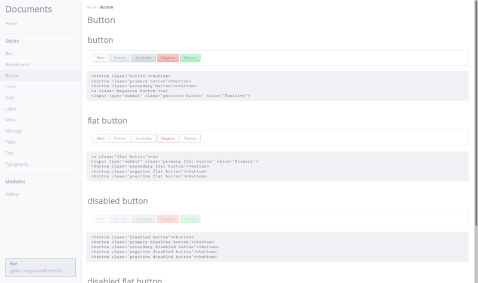

# Styr

[![npm version][version]][npm]

`/stɪ́əɾ/`

Styr; STYlish css framewoRk

[](
https://codeberg.org/grauwoelfchen/styr/raw/trunk/doc/img/screenshot.png)


## Repositories

* https://codeberg.org/grauwoelfchen/styr
* https://git.sr.ht/~grauwoelfchen/styr


## Requirements

* Node.js (>= `v18.15.0`)


## Dependencies

* [normalize.css](https://github.com/necolas/normalize.css)


## Install

```zsh
% npm install styr --save
```

## Features

See https://styr.yasha.app/

### Styles

* [Button](https://styr.yasha.app/button.html)
* [Form](https://styr.yasha.app/form.html)
* [Grid](https://styr.yasha.app/grid.html)
* [Label](https://styr.yasha.app/label.html)
* [Table](https://styr.yasha.app/table.html)
* [Text](https://styr.yasha.app/text.html)
* [Typography](https://styr.yasha.app/typography.html)

### Components

* [Box](https://styr.yasha.app/box.html)
* [Breadcrumb](https://styr.yasha.app/breadcrumb.html)
* [Menu](https://styr.yasha.app/menu.html)
* [Message](https://styr.yasha.app/message.html)
* [Modal](https://styr.yasha.app/modal.html)
* [Pagination](https://styr.yasha.app/pagination.html)
* [Dropdown](https://styr.yasha.app/dropdown.html)
* [Sidebar](https://styr.yasha.app/sidebar.html)


## Development

### Setup

Use [nodenv](https://github.com/nodenv/nodenv) etc. and see `.node-version`.

```zsh
% npm install
```

### Lint

```zsh
# check gulpfile.js
% npm run lint
```

### Build

```zsh
% npm run build
% NODE_ENV=production npm run build
```

### Documentation

```zsh
: open local document
% xdg-open doc/index.html
```


## License

This program is free software: you can redistribute it and/or modify it
under the terms of the MIT License.


See [LICENSE](LICENSE).


```txt
Styr
Copyright (c) 2017-2025 Yasha
```

[version]: https://img.shields.io/npm/v/styr.svg
[npm]: https://www.npmjs.com/package/styr
